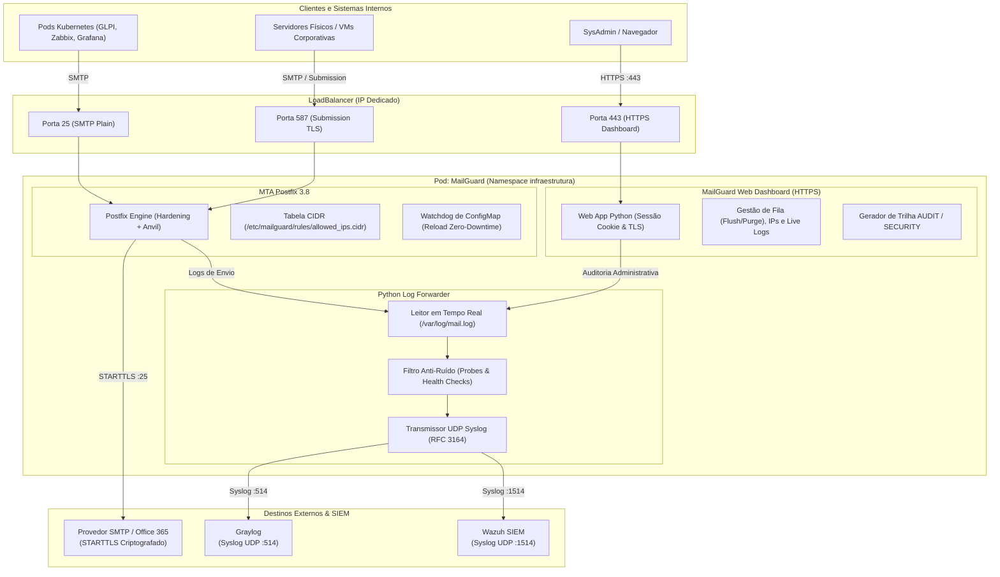

# MailGuard - Servidor SMTP Relay Corporativo & Painel de Controle (Kubernetes)

> **Projeto:** MailGuard MTA  
> **Status:** Ativo / Produção  
> **Versão:** `3.4`  
> **Namespace Kubernetes:** `infraestrutura`  
> **Hostname Padrão:** `mailguard.local`  
> **Painel HTTPS Seguro:** `https://mailguard.local` (Porta `443` com Certificado TLS)  
> **Exposição de Rede:** `type: LoadBalancer` com IP Dedicado  

---

## 📖 1. Visão Geral da Arquitetura

O **MailGuard** é um servidor MTA (*Mail Transfer Agent*) baseado em Postfix 3.8, conteinerizado em Alpine Linux e operado sobre cluster Kubernetes.

Atua como o **ponto centralizado de saída de e-mails** para:
1. **Aplicações e CronJobs no Cluster K8s**: GLPI, Zabbix, Grafana, PHPIPAM, Notificações de CI/CD.
2. **Servidores e VMs fora do Cluster**: Servidores físicos e virtuais nas sub-redes corporativas (`10.x.x.x`, `172.x.x.x`, `192.168.x.x`).
3. **Entrega Segura no Provedor SMTP / Office 365**:
   - Entrega via conector inbound `[smtp.office365.com]:25` (ou endpoint customizado).
   - Criptografia obrigatória com `STARTTLS` (TLSv1.2 e TLSv1.3 com validação de CA).
   - Preservação dos cabeçalhos originais de remetente sem necessidade de credenciais estáticas de usuário.



---

## 🌟 2. Recursos e Funcionalidades

### 🖥️ A. MailGuard Web Dashboard (HTTPS :443)
- **Acesso Seguro Oficial**: `https://mailguard.local` protegido com certificado TLS.
- **Autenticação Segura por Cookie (`HttpOnly`)**:
  - Sessão segura de 24 horas e botão integrado de **Logout (Sair)**.
- **Gestão Completa de Filas**:
  - Visualização de mensagens retidas com ID, data, remetente, destinatário e status de retenção.
  - **Botão "Flush Queue"**: Dispara o reprocessamento imediato da fila (`postqueue -f`).
  - **Botão "Excluir Mensagem"**: Remove mensagens retidas (`postsuper -d <ID>`).
  - **Botão "Zerar Toda a Fila"**: Limpeza de emergência em loops (`postsuper -d ALL`).
- **Live Logs com Filtro Instantâneo**:
  - Visualizador em tempo real dos logs com filtro por e-mail, IP ou status de entrega.
- **Gestão Gráfica de IPs**:
  - Cadastro e exclusão de IPs/redes autorizadas com 1 clique.
- **Disparador de Testes de Envio**:
  - Formulário para testar o envio de e-mails para qualquer endereço diretamente pela web.

---

### 🛡️ B. Segurança, Hardening & Auditoria SIEM
- **Hardening Avançado de Postfix**:
  - Banner limpo (`smtpd_banner = $myhostname ESMTP MailGuard`) ocultando SO e versão.
  - Bloqueio de enumeração de caixas postais (`disable_vrfy_command = yes`).
  - HELO/EHLO mandatório.
  - Rate-Limiting com Anvil (máximo de 50 conexões simultâneas e 300 mensagens/minuto por cliente).
  - Limite de 35MB por mensagem.
- **Trilha Completa de Auditoria no Graylog & Wazuh**:
  - Qualquer alteração de IP, flush/purge de fila, login ou logout é enviada via Syslog como evento estruturado `AUDIT` / `SECURITY`.
- **Stream de Logs Limpo (Filtro Anti-Ruído)**:
  - Probes nativos silenciosos (`kill -0 1`).
  - Descarte automático de conexões de health checks vazias (`commands=0/0`, `lost connection after CONNECT`).

---

### 🌐 C. Gerenciamento Dinâmico de IPs (Zero-Downtime)
- Controlado pelo ConfigMap `mailguard-allowed-ips` montado em `/etc/mailguard/rules/allowed_ips.cidr`.
- O container monitora alterações através de um watchdog em background e recarrega o Postfix (`postfix reload`) instantaneamente sem derrubar conexões ativas.

---

## 📁 3. Estrutura de Arquivos do Projeto

```
.
├── Dockerfile                  # Imagem Alpine 3.19 (Postfix, Python3, Certs, Mailx)
├── entrypoint.sh               # Script de boot, hardening, watchdog e inicialização
├── log_forwarder.py            # Log Forwarder UDP Syslog (Graylog/Wazuh com filtro anti-ruído)
├── dashboard.py                # Servidor Web HTTPS (:443), Auth por Cookie e API REST
├── mailguard.yaml              # Manifestos K8s (Certificate, ConfigMaps, Deployment, Service)
├── manage_ips.sh               # CLI interativa para gestão de IPs autorizados
├── test_mail.sh                # Script utilitário para disparo de e-mails de teste
├── PLANO_IMPLEMENTACAO.md      # Registro histórico e planos técnicos executados
└── README.md                   # Documentação mestre padronizada
```

---

## 🛠️ 4. Guia de Operação & Comandos Úteis

### 4.1. Como Gerenciar IPs Autorizados via CLI
Execute no terminal:

```bash
# 1. Listar regras ativas
./manage_ips.sh list

# 2. Adicionar uma nova VM / Servidor
./manage_ips.sh add 192.168.1.50/32 "Servidor Grafana"

# 3. Adicionar uma sub-rede corporativa
./manage_ips.sh add 192.168.50.0/24 "Rede Servidores"

# 4. Remover uma regra existente
./manage_ips.sh remove 192.168.1.50/32

# 5. Abrir a lista completa no editor interativo
./manage_ips.sh edit
```

---

### 4.2. Como Construir e Publicar Nova Imagem

```bash
# 1. Build da imagem
docker build -t seu-registry/mailguard:3.4 .

# 2. Push para o Registry
docker push seu-registry/mailguard:3.4
```

---

### 4.3. Como Fazer o Deploy no Kubernetes

```bash
# 1. Aplicar os manifestos no namespace infraestrutura
kubectl apply -f mailguard.yaml

# 2. Verificar o status do Pod
kubectl -n infraestrutura get pods -l app=mailguard -o wide

# 3. Verificar o IP dedicado do LoadBalancer
kubectl -n infraestrutura get svc mailguard

# 4. Acompanhar os logs em tempo real
kubectl -n infraestrutura logs -f deployment/mailguard
```

---

### 4.4. Como Testar o Envio de E-mail via Terminal

```bash
# Disparo direto para e-mail de teste
./test_mail.sh usuario@example.com
```

---

## 📊 5. Parâmetros de Configuração (`mailguard-config`)

| Parâmetro | Valor Padrão | Descrição |
|---|---|---|
| `TZ` | `America/Sao_Paulo` | Fuso horário operacional do Postfix e logs. |
| `MYHOSTNAME` | `mailguard.local` | Nome FQDN de identificação do MTA no HELO/EHLO. |
| `SMTP_RELAY_HOST` | `[smtp.office365.com]:25` | Endpoint do conector Inbound do provedor SMTP. |
| `GRAYLOG_HOST` | `graylog.local` | Host do Graylog para exportação de logs via Syslog UDP. |
| `GRAYLOG_PORT` | `514` | Porta Syslog UDP do Graylog. |
| `WAZUH_HOST` | `wazuh.local` | Host do Wazuh para eventos de segurança e auditoria. |
| `WAZUH_PORT` | `1514` | Porta Syslog UDP do Wazuh. |
| `DASHBOARD_PORT` | `443` | Porta HTTPS do painel de controle. |
| `DASHBOARD_USER` | `admin` | Usuário do painel de controle. |
| `DASHBOARD_PASSWORD`| `Admin@2026` | Senha de acesso ao painel. |

---

## 📋 6. Pré-requisitos & Disaster Recovery (Recriação do Zero em Outro Cluster)

Para recriar este projeto do zero em um novo cluster Kubernetes ou ambiente de contingência:

### 1. Pré-requisitos de Infraestrutura Kubernetes:
- **Namespace**: `infraestrutura` (`kubectl create namespace infraestrutura`).
- **Cert-Manager**: Operacional com um `ClusterIssuer` (ex: `cluster-ca-issuer` ou Let's Encrypt). *Ajuste o campo `issuerRef.name` no `mailguard.yaml` conforme seu cluster*.
- **MetalLB ou Cloud LoadBalancer**: Para fornecer o IP externo dedicado na criação do `Service type: LoadBalancer`.

### 2. Pré-requisitos de Rede & Firewall (Regras de Saída):
- **Porta 25 TCP (Saída)**: Liberada da rede do cluster para a Internet para entrega direta ao provedor SMTP / Office 365.
- **Porta 514 UDP (Saída)**: Liberada da rede do cluster para o servidor Graylog.
- **Porta 1514 UDP (Saída)**: Liberada da rede do cluster para o servidor Wazuh.

### 3. Procedimento de Recriação Rápida (Disaster Recovery):
```bash
# Passo 1: Criar namespace caso necessário
kubectl create namespace infraestrutura

# Passo 2: Construir e publicar imagem
docker build -t seu-registry/mailguard:3.4 .
docker push seu-registry/mailguard:3.4

# Passo 3: Aplicar manifestos
kubectl apply -f mailguard.yaml
```
